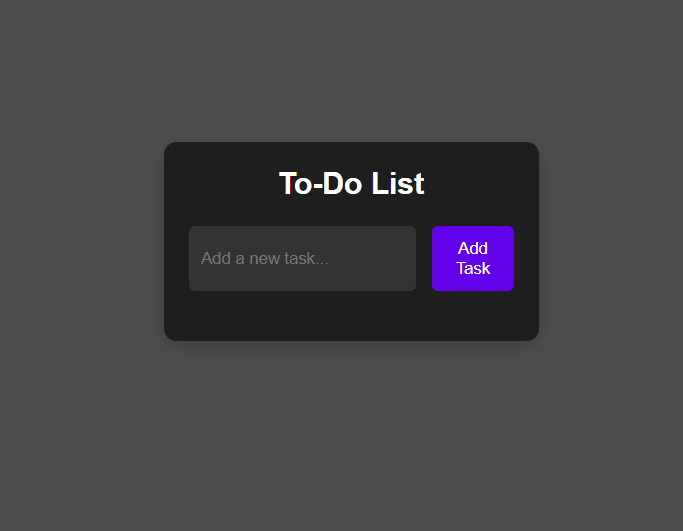

# ToDoList ✅
A simple **To-Do List** web app built with `HTML`, `CSS`, and `JavaScript`.

---

## Features 🔧
- Add and remove tasks
- Mark tasks complete
- Simple and responsive UI

## How to run ▶️
1. Open `index.html` in your browser.

> **Note:** Replace `assets/screenshot.png` with your final screenshot to update the README's image.
